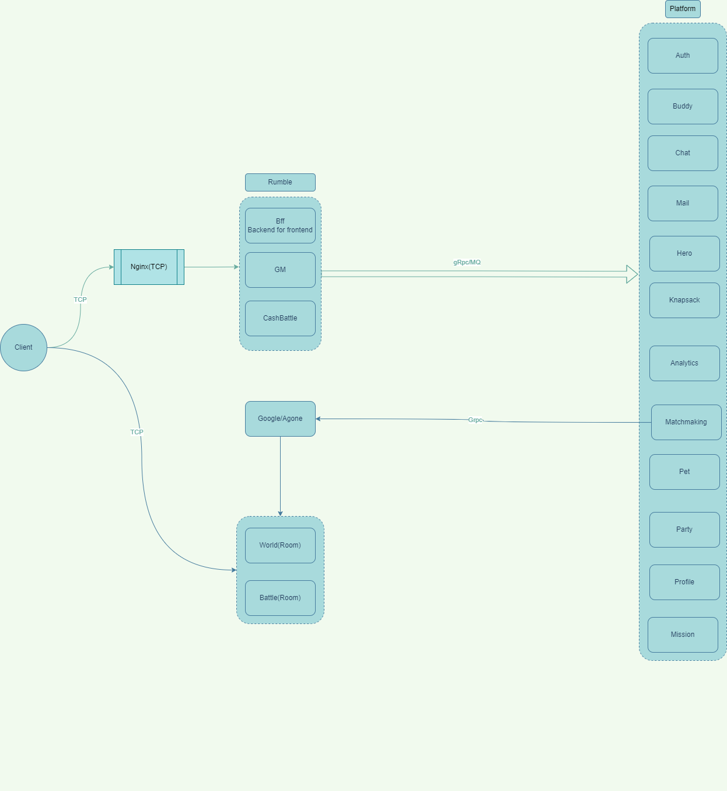

# Platform

A platform service for power up

* cmd/platform:  all in one platform service

## Architecture



## Docker

#### build

```shell
# fix {appname} to service name
docker buildx build -t {appname}.registry.com:latest --build-arg APP_NAME={appname} -f ./build/package/docker/Dockerfile .  --push
```

## Security

* MTls: https://www.cloudflare.com/zh-cn/learning/access-management/what-is-mutual-tls/
