# Platform

中台服务,包含许多公共服务

## Services:

* Auth: 用户认证服务,支持JWT token校验
* Analytics: BI日志服务，支持thinkingData，MixPanel，localFile，ClickHouse等方式
* Buddy: 好友服务，支持加好友/删除好友/拉黑/好友列表等功能
* Chat: 聊天服务，支持私聊/群聊/频道聊天，暂时不支持离线消息
* Knapsack: 背包服务，支持Item{ID, Count, Type,Expire}
* Leaderboard: 排行榜服务，更新排行榜，获取排行榜，支持多种排行榜类型
* Mail: 邮件服务，发送附件邮件，支持模板，过期时间，附件等功能
* Matchmaking: 匹配服务，分配房间 基于[open-match](https://open-match.dev/site/)+ [agones](https://agones.dev/site/)实现
* Party: 组队服务，组队/踢人/解散队伍等功能
* Profile: 玩家基本信息服务，创建/更新玩家基本信息
* Room: 房间管理服务，创建/加入/离开/销毁房间，房间内提供通用 lockstep 帧同步服务

## diagram:

```mermaid
graph TD
    %% Client/Consumer Layer
    subgraph "Client/Consumer Layer"
        CA1["Auth Client"]:::client
        CA2["Chat Client"]:::client
        CA3["Other Clients"]:::client
        CT1["Auth Integration Tests"]:::test
    end

    %% API Gateway / Edge Services
    subgraph "API Gateway / Edge Services"
        GW1["Auth REST Gateway"]:::gateway
        GW2["Chat REST Gateway"]:::gateway
    end

    %% Microservices Layer
    subgraph "Microservices Layer"
        MI1["Auth Service (public/private)"]:::service
        MI2["Analytics Service (public/private)"]:::service
        MI3["Buddy Service (public/private)"]:::service
        MI4["Chat Service (public/private)"]:::service
        MI5["Knapsack Service (public/private)"]:::service
        MI6["Leaderboard Service (public/private)"]:::service
        MI7["Mail Service (public/private)"]:::service
        MI8["Matchmaking Service (public/private)"]:::service
        MI9["Party Service (public/private)"]:::service
        MI10["Profile Service (public/private)"]:::service
        MI11["Room Service (public/private)"]:::service
    end

    %% Data Storage / Database Layer
    subgraph "Data Storage / Database Layer"
        DB1["Auth DB/Redis"]:::database
        DB2["Buddy DB"]:::database
        DB3["Knapsack DB"]:::database
        DB4["Leaderboard DB"]:::database
        DB5["Profile Redis"]:::database
    end

    %% External Integrations
    subgraph "External Integrations"
        EX1["Analytics BI (ThinkingData,MixPanel,ClickHouse)"]:::external
        EX2["Matchmaking (Agones/OpenMatch)"]:::external
    end

    %% API Definitions / Contracts
    subgraph "API Definitions / Contracts"
        API["API Contracts (Protobuf)"]:::apicontracts
    end

    %% Containerization & Deployment
    subgraph "Containerization & Deployment"
        DOCKER["Docker"]:::container
        KUBE["Kubernetes"]:::container
        CI["CI/CD (GitHub Workflows)"]:::container
    end

    %% Connections between Layers
    %% Client Layer to API Gateway
    CA1 -->|"requests"| GW1
    CA2 -->|"requests"| GW2
    CA3 -->|"requests"| GW1
    CT1 -->|"tests"| GW1

    %% API Gateway to Microservices (public endpoints)
    GW1 -->|"forwards"| MI1
    GW2 -->|"forwards"| MI4

    %% Inter-service communication (example flows)
    MI1 -->|"gRPC"| MI2
    MI4 -->|"gRPC"| MI1

    %% Microservices to Data Storage
    MI1 -->|"stores"| DB1
    MI3 -->|"stores"| DB2
    MI5 -->|"stores"| DB3
    MI6 -->|"stores"| DB4
    MI10 -->|"stores"| DB5

    %% Microservices to External Integrations
    MI2 -->|"BI calls"| EX1
    MI8 -->|"matchmaking"| EX2

    %% API Contracts used by Microservices
    API -->|"defines"| MI1
    API -->|"defines"| MI2
    API -->|"defines"| MI3
    API -->|"defines"| MI4
    API -->|"defines"| MI5
    API -->|"defines"| MI6
    API -->|"defines"| MI7
    API -->|"defines"| MI8
    API -->|"defines"| MI9
    API -->|"defines"| MI10
    API -->|"defines"| MI11

    %% Containerization & Deployment flow
    CI -->|"triggers build"| DOCKER
    DOCKER -->|"deploys to"| KUBE
    KUBE -->|"runs"| MI1

    %% Styles
    classDef client fill:#AEDFF7,stroke:#333,stroke-width:2px;
    classDef gateway fill:#FFA07A,stroke:#333,stroke-width:2px;
    classDef service fill:#90EE90,stroke:#333,stroke-width:2px;
    classDef database fill:#F4A460,stroke:#333,stroke-width:2px;
    classDef external fill:#87CEFA,stroke:#333,stroke-width:2px;
    classDef container fill:#DDA0DD,stroke:#333,stroke-width:2px;
    classDef apicontracts fill:#F5DEB3,stroke:#333,stroke-width:2px;
    classDef test fill:#FFB6C1,stroke:#333,stroke-width:2px;

    %% Click Events
    click CA1 "https://github.com/moke-game/platform/tree/main/cmd/auth/client"
    click CA2 "https://github.com/moke-game/platform/tree/main/cmd/chat/client"
    click CT1 "https://github.com/moke-game/platform/tree/main/tests/auth"
    click GW1 "https://github.com/moke-game/platform/blob/main/api/gen/auth/api/auth.pb.gw.go"
    click GW2 "https://github.com/moke-game/platform/blob/main/api/gen/chat/api/chat.pb.gw.go"
    click MI1 "https://github.com/moke-game/platform/tree/main/services/auth"
    click MI2 "https://github.com/moke-game/platform/tree/main/services/analytics"
    click MI3 "https://github.com/moke-game/platform/tree/main/services/buddy"
    click MI4 "https://github.com/moke-game/platform/tree/main/services/chat"
    click MI5 "https://github.com/moke-game/platform/tree/main/services/knapsack"
    click MI6 "https://github.com/moke-game/platform/tree/main/services/leaderboard"
    click MI7 "https://github.com/moke-game/platform/tree/main/services/mail"
    click MI8 "https://github.com/moke-game/platform/tree/main/services/matchmaking"
    click MI9 "https://github.com/moke-game/platform/tree/main/services/party"
    click MI10 "https://github.com/moke-game/platform/tree/main/services/profile"
    click MI11 "https://github.com/moke-game/platform/tree/main/services/room"
    click DB1 "https://github.com/moke-game/platform/tree/main/services/auth/internal/db"
    click DB2 "https://github.com/moke-game/platform/tree/main/services/buddy/internal/db"
    click DB3 "https://github.com/moke-game/platform/tree/main/services/knapsack/internal/db"
    click DB4 "https://github.com/moke-game/platform/tree/main/services/leaderboard/internal/db"
    click DB5 "https://github.com/moke-game/platform/tree/main/services/profile/internal/db/redis"
    click EX1 "https://github.com/moke-game/platform/tree/main/services/analytics/internal/service/bi"
    click EX2 "https://github.com/moke-game/platform/tree/main/services/matchmaking/internal/agones"
    click DOCKER "https://github.com/moke-game/platform/tree/main/build/package/docker/Dockerfile"
    click KUBE "https://github.com/moke-game/platform/tree/main/deployment/k8s"
    click CI "https://github.com/moke-game/platform/tree/main/.github/workflows"
    click API "https://github.com/moke-game/platform/tree/main/api"
```


## 目录结构规范 ：

工程目录结构参考[project-layout](https://github.com/golang-standards/project-layout)

## 运行：

* 你可以运行`cmd/platform/service/main.go`来启动所有服务， 你也可以参考`cmd/platform/service/main.go`来自定义组装服务。
* 你可以运行`cmd/{service-name}/service/main.go`来启动单个服务,例如：`cmd/auth/service/main.go` 来启动auth服务

## 容器化

```shell
# fix {appname} to service name
docker buildx build -t {appname}.registry.com:latest --build-arg APP_NAME={appname} -f ./build/package/docker/Dockerfile .  --push
```

## 如何测试？

### Integration Test

* build your interactive client:
   ```shell
     go build -o client.exe ./cmd/{game-name}/client/main.go 
   ```
* run your interactive client:
    ```shell
     # help
     ./{game-name}.exe help
    ```
  tips: http client use Postman to connect `localhost:8081`.

### Load Test

* install [k6](https://grafana.com/docs/k6/latest/get-started/installation/)
* run k6 load test
   ``` shell
    # fix the game-name to your game name
    k6 run ./tests/{game-name}/{game-name}.js
  ```

## 服务安全:

* JWT token: https://www.okta.com/identity-101/what-is-token-based-authentication/
* mTLS: https://www.cloudflare.com/zh-cn/learning/access-management/what-is-mutual-tls/

## 服务类型：

每个服务包含两种类型的服务：

* private service: 不会校验JWT token, 会走mTLS认证，适用于内部服务调用例如：gm, admin，或者其他内部服务调用。
* public service: 会校验JWT token, 会走mTLS认证 适用于其他外部服务调用。
