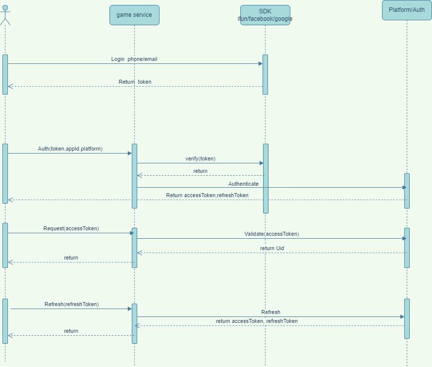
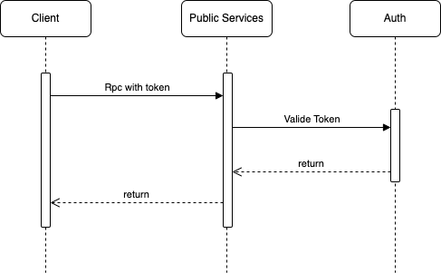

# Auth Service

token认证服务器，提供用户认证服务。[为什么需要token认证?](https://www.okta.com/identity-101/what-is-token-based-authentication/)

## 流程图

## 服务说明

* 所有服务的`public`类型都需要认证，认证通过后才能访问。

## Assembly matrix

| Module | Provides | When to use |
|--------|----------|-------------|
| `AuthModule` | Auth gRPC service + settings | Rare; prefer `AuthAllModule` for `cmd/auth` |
| `AuthClientModule` | `AuthServiceClient` | Call ValidateToken / Authenticate without hosting auth |
| `AuthMiddlewareModule` | Client + `AuthCheckModule` (`AuthMiddleware`) + prod guard | Any process hosting **public** gRPC/HTTP |
| `AuthAllModule` | Service + client + middleware + prod guard | Aggregate/monolith (`cmd/platform`, local game) and dedicated `cmd/auth` |
| `PrivateServiceAuthModule` | Pass-through `AuthMiddleware` + prod guard | Private-only processes (`cmd/analytics`) for kit #224+ binder. Prod guard rejects combining with **public** gRPC/gateway (no `WithoutAuth`). Private gateway (e.g. analytics) is OK. |
| `SupabaseMiddlewareModule` | Alternate JWT middleware | Supabase auth path |

| Surface | Rule |
|---------|------|
| Public `*Service` | No `utility.WithoutAuth`; process **must** import `AuthMiddlewareModule` (or `AuthAllModule`); handlers read `UIDContextKey` |
| Private `*PrivateService` | Embed `utility.WithoutAuth`; internal network only |
| Auth / Analytics | Embed `utility.WithoutAuth` by design |

### Public vs private

- **Public**: profile, knapsack, mail, chat, leaderboard, party, buddy, matchmaking, and any game template public API.
- **Private**: `*PrivateService` counterparts (profile/knapsack/mail/chat/leaderboard private) plus auth & analytics.

### Fail-closed (prod)

`AuthMiddlewareModule` / `AuthAllModule` / `PrivateServiceAuthModule` run a startup check: if `DEPLOYMENT` is prod and any **public** gRPC or gateway service is registered without `AuthMiddleware`, the process refuses to start.

**Limitation:** the platform guard is an `fx.Invoke` inside those auth modules. A main that forgets them will not run the guard. Mitigations:

- moke-kit ≥ #221 fails closed **per request** in production when middleware is nil
- kit [#224](https://github.com/GStones/moke-kit/pull/224) binder fails closed at startup when grpc/gateway lack middleware (on kit main; bump when ready)
- `cmd/auth` → `AuthAllModule`; private-only `cmd/analytics` → `PrivateServiceAuthModule`
